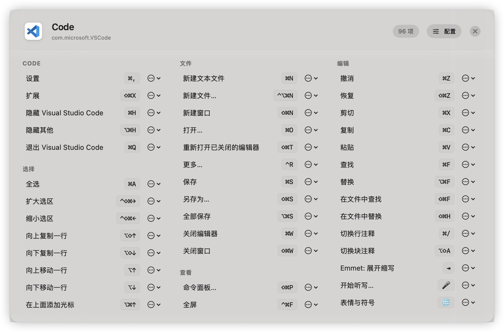

# KeyTip

KeyTip 是一个 macOS 菜单栏工具，用来快速查看当前前台应用的菜单栏快捷键。

它的交互非常直接：长按一个设定好的修饰键，KeyTip 会读取当前 App 的菜单结构，并以 HUD 浮层的形式展示可用快捷键和自定义展示项。你不需要切出当前应用，也不需要翻菜单逐项找命令。

> 当前仓库仍处于可运行原型阶段，但主流程已经可用。



## 适合什么场景

- 你记得某个命令存在，但忘了它的快捷键
- 你在不同 App 之间切换，想快速确认当前 App 的菜单快捷键
- 你希望为特定 App 追加一组自己的“展示型快捷键”或“展示型命令”
- 你想隐藏一些自己永远不会看的系统菜单项，让 HUD 更干净

## 当前能力

- 菜单栏常驻运行，隐藏 Dock 图标
- 长按全局修饰键显示 HUD，松开后自动关闭
- 自动识别当前前台应用的名称、图标和 Bundle ID
- 通过 Accessibility API 读取当前应用菜单栏中的快捷键信息
- 按菜单分组展示系统快捷键
- 支持在 HUD 中打开“当前 App 的配置文件”
- 支持在 HUD 中复制系统项 ID，或直接隐藏某个系统项
- 支持按应用追加自定义展示项
- 支持两类自定义内容：
  - 展示型快捷键
  - 展示型命令
- 提供基础偏好设置页，可调整触发修饰键和长按时长
- 提供应用配置列表，可打开配置文件目录、打开单个配置、删除已有配置

## 当前状态

目前已经打通的主流程：

1. 以菜单栏应用启动
2. 检查并请求辅助功能权限
3. 监听全局修饰键长按
4. 识别当前前台应用
5. 读取该应用菜单栏快捷键
6. 合并该应用对应的展示配置
7. 以 HUD 面板展示内容

当前仍未完成或仍比较原型化的部分：

- “登录时自动启动”还是占位项
- 还没有完整的 GUI 配置编辑器，高级配置仍以手动编辑 TOML 为主
- 还没有搜索、排序规则编辑、实时热更新等增强能力
- 核心逻辑的自动化测试覆盖仍然很薄

## 运行环境

- macOS 14.0+
- Xcode 16+
- Swift 6

## 下载

如果你只是想直接体验 KeyTip，不需要自己编译。

可以前往 GitHub Releases 下载已经构建好的版本：

[下载最新版本](https://github.com/conjeeohh/KeyTip/releases)

下载后，将应用拖入“应用程序”目录，再首次运行并授予辅助功能权限即可。

## 快速开始

如果你希望自己编译和开发，请按下面的方式运行：

1. 克隆仓库
2. 用 Xcode 打开 `KeyTip.xcodeproj`
3. 选择 `KeyTip` target
4. 直接运行到本机
5. 首次启动后授予辅助功能权限
6. 在菜单栏中找到 KeyTip 图标

由于这是一个菜单栏应用，运行后不会出现在 Dock 中。

## 使用方式

默认交互如下：

- 长按 `Command` 键约 `0.6` 秒显示 HUD
- 松开修饰键后关闭 HUD
- HUD 显示期间按下其他按键会中断显示
- 点击 HUD 外部区域也会关闭 HUD

当前可在偏好设置中调整：

- 触发修饰键：`Command` / `Option` / `Control` / `Shift`
- 长按触发时长：`0.3s` 到 `1.5s`

## 权限说明

KeyTip 的核心能力依赖 macOS 的 Accessibility API。

应用会使用这些能力：

- 读取前台应用的菜单栏结构
- 提取菜单项标题、快捷键字符、修饰键信息
- 监听全局修饰键状态变化

如果没有授予辅助功能权限，KeyTip 无法可靠读取其他应用的菜单栏快捷键。

授权入口：

- 系统设置
- 隐私与安全性
- 辅助功能

## 按应用配置

KeyTip 当前采用“每个 App 一个配置文件”的方式管理展示内容。

配置目录：

```text
~/Library/Application Support/KeyTip/apps/
```

文件命名：

```text
<bundle-id>.toml
```

例如：

```text
~/Library/Application Support/KeyTip/apps/com.apple.Safari.toml
~/Library/Application Support/KeyTip/apps/com.microsoft.VSCode.toml
```

你可以通过以下入口打开配置：

- HUD 顶部的“配置”按钮
- 偏好设置中的“应用配置”页
- 偏好设置中的“打开配置文件目录”

如果某个 App 的配置文件还不存在，KeyTip 会在首次打开时自动创建模板。

## 配置格式

当前支持以下字段：

- `include_system_shortcuts`
  - 类型：`bool`
  - 默认值：`true`
  - 作用：是否展示系统读取到的菜单快捷键
- `hide`
  - 类型：`string[]`
  - 默认值：空数组
  - 作用：隐藏指定的系统项 ID
- `[[items]]`
  - 类型：数组表
  - 作用：追加自定义展示项

每个 `[[items]]` 支持这些字段：

- `title`
  - 必填
  - 展示标题
- `group`
  - 选填
  - HUD 中显示的分组名，默认是 `自定义`
- `shortcut`
  - 与 `command` 二选一
  - 用于展示一个快捷键文本
- `command`
  - 与 `shortcut` 二选一
  - 用于展示一个命令文本

示例：

```toml
include_system_shortcuts = true
hide = [
  "文件.关闭标签页.⌘W",
]

[[items]]
title = "切换到左侧标签页"
shortcut = "⌘⇧["
group = "标签页"

[[items]]
title = "打开阅读模式"
command = "Show Reader"
group = "命令"
```

补充说明：

- `hide` 中的值需要匹配系统项 ID
- 你可以在 HUD 的系统项菜单中使用“复制 ID”来获取这个值
- `shortcut` 和 `command` 不能同时存在
- 配置文件解析失败时，应用不会崩溃，会回退到默认展示配置

## HUD 行为

HUD 展示内容由两部分组成：

- 系统项：来自当前前台应用的菜单栏快捷键
- 自定义项：来自当前 App 对应的 TOML 配置

展示规则：

- 当 `include_system_shortcuts = true` 时，系统项会被读取并按菜单分组展示
- `hide` 只作用于系统项
- 自定义项会追加到 HUD 中，并按 `group` 分组
- 自定义快捷键会显示为键帽样式
- 自定义命令会显示为普通命令胶囊，不会伪装成真实可执行动作

## 已知限制

- 依赖 Accessibility API，不同应用暴露出的菜单结构质量差异很大
- 某些应用没有标准菜单栏，或者不会完整暴露快捷键信息
- 当前只覆盖“菜单栏中可读到的内容”，不包含应用私有命令、命令面板动作、插件内部快捷键等
- 当前还没有图形化的 item 级编辑器，复杂配置仍需手动改 TOML
- 当前没有文件变化监听，修改配置后需要下次打开 HUD 才会重新读取

## 项目结构

```text
KeyTip/
├── KeyTipApp.swift             # SwiftUI 应用入口
├── AppDelegate.swift           # 菜单栏、生命周期、热键与 HUD 调度
├── HotKeyManager.swift         # 全局长按触发逻辑
├── ActiveAppInfo.swift         # 前台应用信息检测
├── AccessibilityHelper.swift   # 辅助功能权限检查与引导
├── MenuBarReader.swift         # Accessibility 菜单读取引擎
├── ShortcutItem.swift          # 系统快捷键数据模型
├── DisplayConfiguration.swift  # 按应用展示配置模型
├── DisplayConfigParser.swift   # TOML 配置解析
├── DisplayConfigSerializer.swift # TOML 配置序列化
├── DisplayContentBuilder.swift # 系统项与自定义项组装
├── ConfigStore.swift           # 按应用配置文件读写
├── HUDPanel.swift              # AppKit HUD 面板
├── HUDPanelController.swift    # HUD 展示控制器
├── HUDContentView.swift        # SwiftUI HUD 内容
├── SettingsView.swift          # 偏好设置界面
└── HotKeyConfig.swift          # 触发配置定义
```

## 开发说明

项目目前采用以下组合：

- SwiftUI：偏好设置与 HUD 内容渲染
- AppKit：菜单栏图标、`NSPanel`、全局事件监听
- Accessibility API：读取前台应用菜单栏快捷键
- TOML 文件：按应用持久化展示配置

当前代码重点是把“读取菜单快捷键 + 配置化展示”这条链路跑通，因此整体更偏原型，而不是完整产品化实现。

## 贡献方向

欢迎围绕以下方向继续完善：

- 更好的 HUD 信息架构和交互
- 图形化配置编辑体验
- 更稳的 Accessibility 兼容性
- 登录启动与应用发布流程
- 核心逻辑测试覆盖

## License

本项目使用 Apache License 2.0，详见 `LICENSE`。
